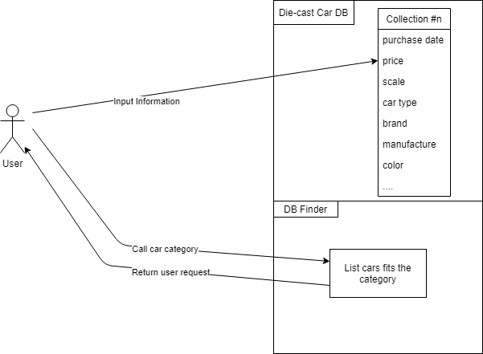

## CIS 3206 Final Project Proposal

**Diecast DB**

- **Project Abstract**
The purpose of this project is to build a database of diecast model car collection. This webpage will let user input the detailed information about their collection and categroized each car. So that the usere can have easy access to their list of collection.

- **Background**
I am a die-cast model car collector. I have nearlly 500 model cars collction in my room. Recently I have a issue that I cannot keep in track on all of my collections and sometimes I bougth the same car just because I forgot I had bought it. As a result, I have a lot of duplicate cars that I do not even notice. In order to solve this problem, I came up wth a idea that I can have a program, which promt me to enter detailed information, like brand , menufacture, car category, image...., about the car after I purchase it. So that I can have my own data base of my collection. Not only I keep track on all of my collections, I will never purchase same car again.
- **Conceptual Design**
I decided to use Wordpress as a user interface of website and MariaDB as database of my server. A Java program that runs in webserver and linked to database, so this program is able to return the object that fits the category. And the user are making request by category in order to find objects that are in common. The project is important since it can increase the porductivity of a person, especially when the person have a lot of objects that need to be categorized.
- **Project Relevance**
The reason why this data base project is relevent to the objective of software design course is that it involves object oriented programing skills, TTD, version contorl and debugging. After building this project, I am able to learn a lot details in software design. On top of that, This database can be used on various of applications including educationl purpose. For instance, program designer can categorize their projects, instructors are able to find students' submisstion by referencing category. 

- **Reference**
http://tomicadas.on.coocan.jp/

http://tomica.minibird.jp/

https://www.hobbydb.com/

http://www.carqueryapi.com/

> Written with [StackEdit](https://stackedit.io/).
